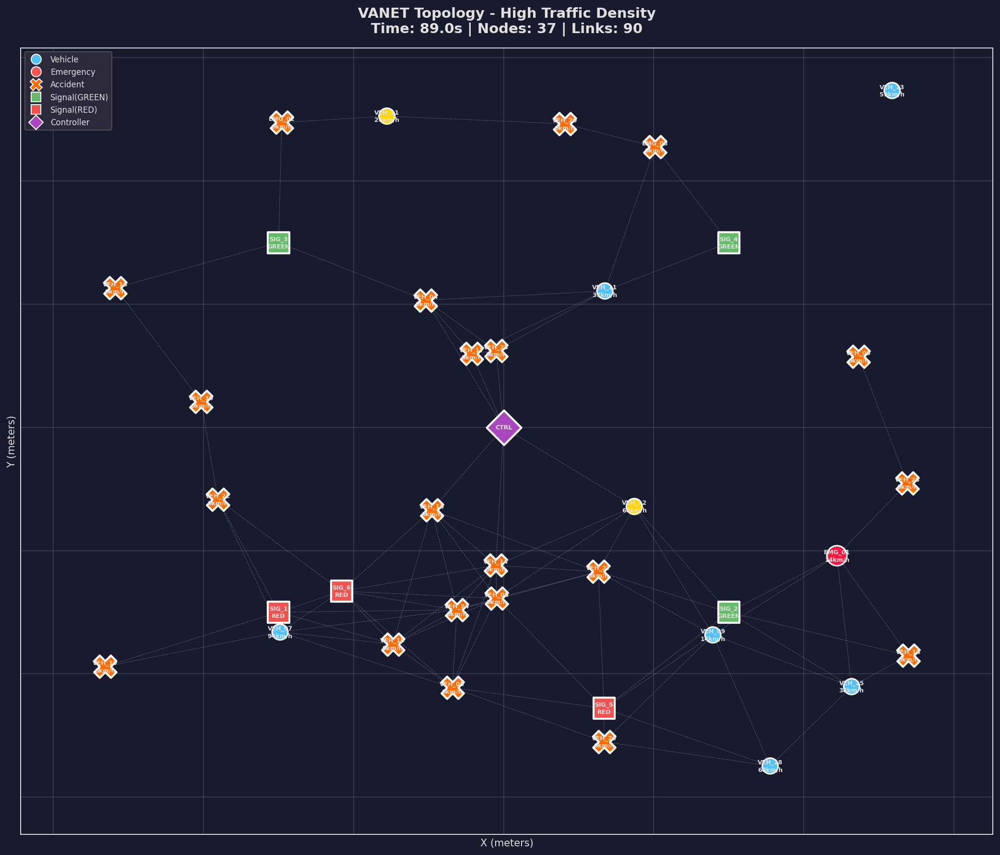
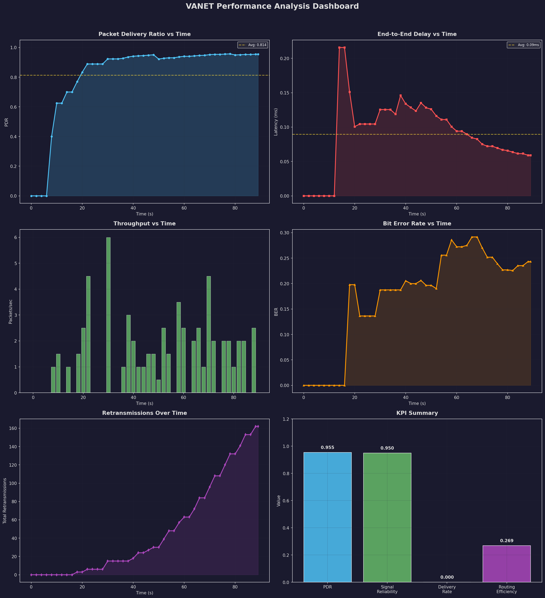
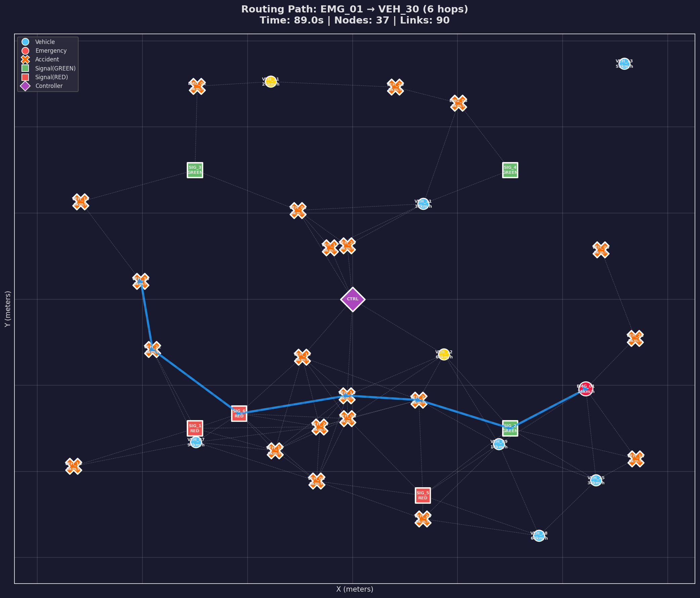
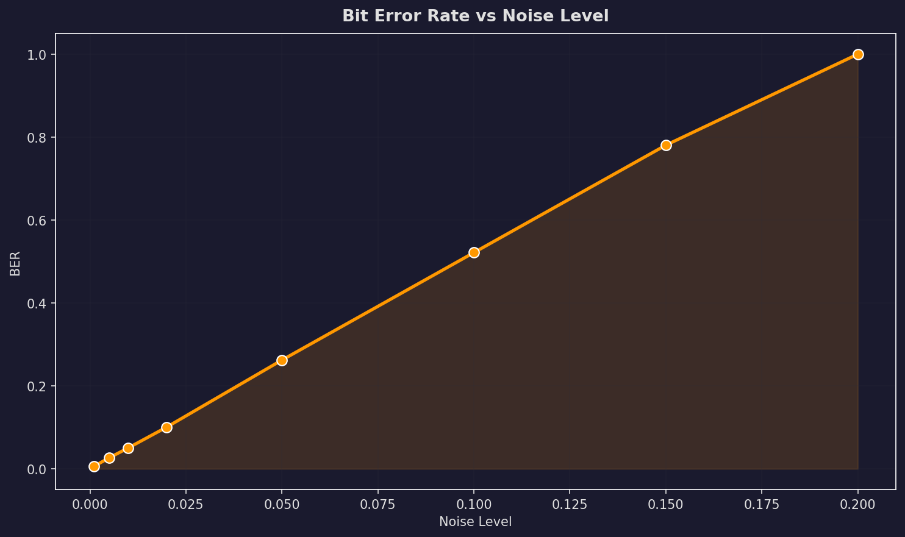
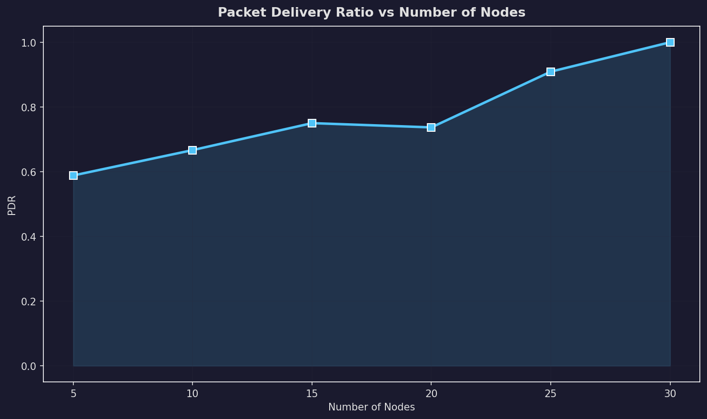

# 🚗 Smart Traffic Communication System 🚦

A complete **VANET (Vehicular Ad Hoc Network)** simulation system built in Python, implementing a multi-layer networking architecture for intelligent traffic management.



---

## ✨ Features

- **Multi-Layer Architecture** — Physical, Data Link, and Network layers as independent modules
- **Accident Alert System** — Broadcast accident notifications across the network
- **Emergency Vehicle Priority** — Ambulance/fire truck signals turn traffic lights green
- **Smart Traffic Signals** — Adaptive timing based on vehicle density
- **Congestion Detection** — Real-time monitoring of vehicle speeds
- **Multi-Hop Routing** — Dijkstra's shortest path with dynamic topology updates
- **Performance Dashboard** — 8 auto-generated visualization graphs
- **6 Simulation Scenarios** — From basic to stress test

---

## 🚀 Quick Start

### Prerequisites
```bash
pip install matplotlib networkx numpy
```

### Run
```bash
python traffic_system/main.py
```

### Run with a specific scenario
```bash
python traffic_system/main.py --scenario high_traffic
python traffic_system/main.py --scenario emergency
python traffic_system/main.py --scenario noisy_channel
python traffic_system/main.py --scenario stress_test
```

---

## 📊 Sample Output

### Performance Dashboard


### Routing Path (Multi-Hop)


### BER vs Noise Level


### PDR vs Number of Nodes


---

## 🏗️ Architecture

```
traffic_system/
├── physical/          # Layer 1 — Bit transmission + noise simulation
├── datalink/          # Layer 2 — Framing + CRC-16 + Stop-and-Wait ARQ
├── network/           # Layer 3 — Dijkstra routing + broadcast flooding
├── nodes/             # Vehicle, Traffic Signal, Central Controller
├── simulation/        # Time-stepped simulation engine + scenarios
├── visualization/     # Network graphs + performance dashboard
├── metrics/           # KPI collection and computation
└── main.py            # Main runner script
```

---

## 📈 KPIs Computed

| KPI | Layer |
|-----|-------|
| Bit Error Rate (BER) | Physical |
| Signal Reliability | Physical |
| Frame Error Rate | Data Link |
| Retransmission Count | Data Link |
| Packet Delivery Ratio (PDR) | Network |
| Average Latency | Network |
| Average Hop Count | Network |
| Throughput (pkts/sec) | System |
| Routing Efficiency | System |
| Network Load | System |

---

## 📖 Documentation

See [WALKTHROUGH.md](traffic_system/WALKTHROUGH.md) for detailed documentation including:
- Layer-by-layer architecture explanation
- Frame structure and protocol diagrams
- All 8 output visualizations
- Design decisions

---

## 🛠️ Tech Stack

- **Python 3.10+**
- **matplotlib** — Performance graphs
- **networkx** — Network topology and routing
- **numpy** — Numerical computation

---

## 📝 License

MIT License
