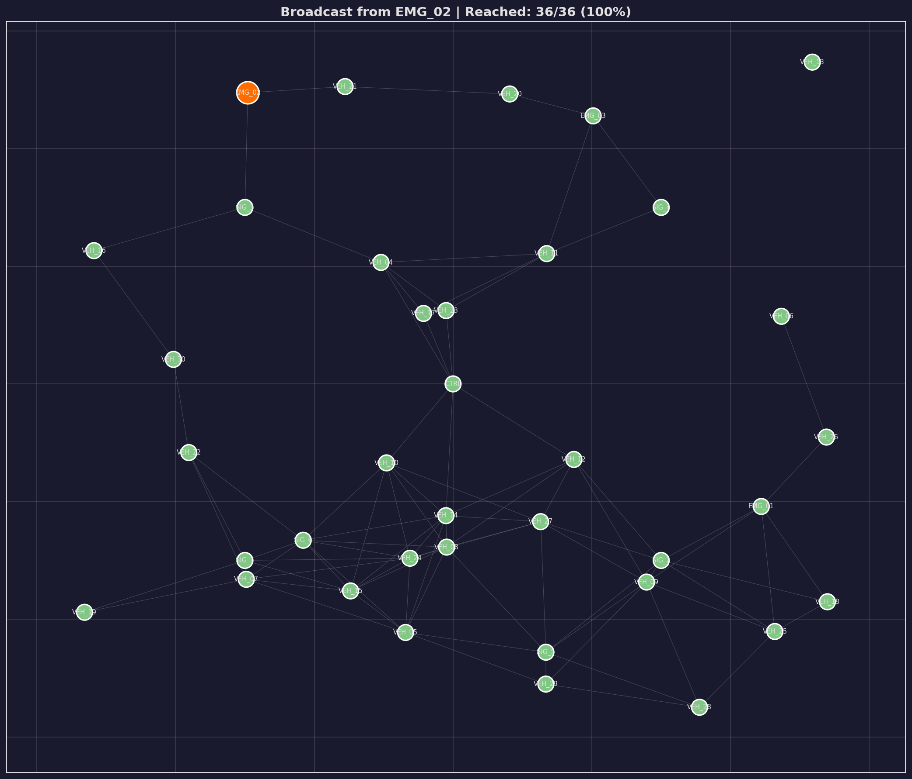
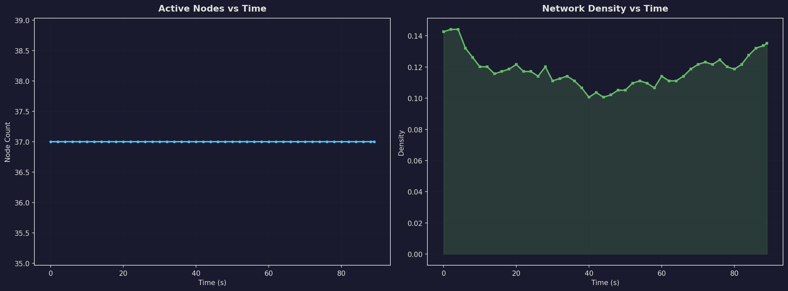
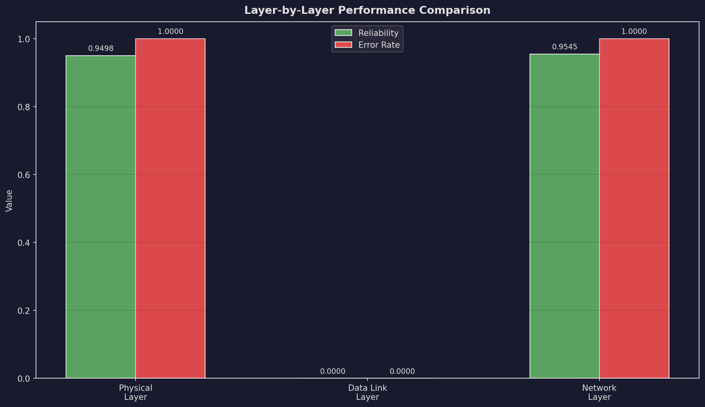

# Smart Traffic Communication System — Walkthrough

## Overview

A complete **VANET (Vehicular Ad Hoc Network)** simulation system implementing a multi-layer networking architecture with **Physical, Data Link, and Network layers** for intelligent traffic management.

The system simulates vehicles and traffic signals communicating to detect accidents, manage congestion, provide emergency vehicle priority, and enable multi-hop communication.

---

## Project Structure

```
traffic_system/
│
├── physical/                # Layer 1 — Physical Layer
│   ├── __init__.py
│   ├── channel.py           # Wireless channel: noise, attenuation, packet loss
│   └── transmitter.py       # Per-node physical transmitter
│
├── datalink/                # Layer 2 — Data Link Layer
│   ├── __init__.py
│   ├── crc.py               # CRC-16 CCITT error detection
│   ├── frame.py             # Frame structure with serialization
│   └── arq.py               # Stop-and-Wait ARQ retransmission
│
├── network/                 # Layer 3 — Network Layer
│   ├── __init__.py
│   ├── packet.py            # Network packets (Unicast, Broadcast, Emergency, etc.)
│   ├── topology.py          # Dynamic graph topology using networkx
│   └── router.py            # Dijkstra routing, broadcast flooding
│
├── nodes/                   # VANET Node Types
│   ├── __init__.py
│   ├── base_node.py         # Abstract base node class
│   ├── vehicle.py           # Vehicle node (car, ambulance, fire truck, police)
│   ├── traffic_signal.py    # Traffic signal with adaptive timing
│   └── controller.py        # Central controller for coordination
│
├── simulation/              # Simulation Engine
│   ├── __init__.py
│   ├── engine.py            # Time-stepped simulation loop
│   └── scenarios.py         # 6 predefined test scenarios
│
├── visualization/           # Graphs & Dashboards
│   ├── __init__.py
│   ├── network_viz.py       # Network topology & broadcast visualization
│   └── dashboard.py         # Performance analysis dashboard (6-panel)
│
├── metrics/                 # KPI Tracking
│   ├── __init__.py
│   ├── collector.py         # Time-series metrics collection
│   └── kpi.py               # KPI computation & formatted output
│
├── main.py                  # Main runner script
└── WALKTHROUGH.md           # This file
```

---

## How to Run

### Prerequisites

- Python 3.10+
- Required packages: `matplotlib`, `networkx`, `numpy`

```bash
pip install matplotlib networkx numpy
```

### Running the Simulation

```bash
# Run with default (basic) scenario
python traffic_system/main.py

# Run a specific scenario
python traffic_system/main.py --scenario high_traffic

# Use a custom random seed
python traffic_system/main.py --scenario emergency --seed 123

# Show help
python traffic_system/main.py --help
```

### Available Scenarios

| Scenario | Vehicles | Signals | Emergency | Noise | Duration | Description |
|----------|----------|---------|-----------|-------|----------|-------------|
| `basic` | 12 | 4 | 1 | 0.005 | 60s | Moderate traffic, normal conditions |
| `high_traffic` | 30 | 6 | 3 | 0.008 | 90s | Dense traffic, frequent congestion |
| `emergency` | 15 | 5 | 5 | 0.003 | 60s | Multiple emergency vehicles with priority |
| `noisy_channel` | 10 | 4 | 1 | 0.05 | 60s | High noise/packet loss to stress ARQ |
| `multi_accident` | 20 | 4 | 3 | 0.01 | 60s | High accident rate to test broadcasting |
| `stress_test` | 40 | 8 | 5 | 0.03 | 120s | Maximum load stress test |

---

## Layer Architecture — Detailed Explanation

### 📡 Physical Layer (Layer 1)

**Files:** `physical/channel.py`, `physical/transmitter.py`

**Purpose:** Simulates the wireless communication medium between VANET nodes.

**What it does:**
- **Binary Encoding:** Converts text data to binary (`text_to_binary`) and back (`binary_to_text`)
- **Noise Injection:** Each bit has a configurable probability of being flipped (simulating wireless interference)
- **Distance-based Attenuation:** Uses a log-distance path loss model — noise increases as nodes get farther apart
- **Packet Loss:** Random complete transmission failures with probability that scales with distance
- **Propagation Delay:** Calculated from distance + random processing delay (1–5ms)

**Key Metrics:**
- **Bit Error Rate (BER):** `total_bits_errored / total_bits_sent`
- **Signal Reliability:** `1.0 - packet_loss_rate`

**Example:**
```
Channel with noise_level=0.01 at 100m distance:
  - Effective noise = 0.01 / attenuation_factor
  - Each bit independently flipped with that probability
  - BER ≈ 0.055 at end of basic simulation
```

---

### 🔗 Data Link Layer (Layer 2)

**Files:** `datalink/crc.py`, `datalink/frame.py`, `datalink/arq.py`

**Purpose:** Provides reliable point-to-point communication between adjacent nodes.

**Frame Structure:**
```
┌───────┬──────┬─────┬────────┬──────┬────────┬──────┬─────┬─────┐
│ START │ TYPE │ SEQ │ SOURCE │ DEST │ LENGTH │ DATA │ CRC │ END │
│<<SOF>>│ DATA │  0  │ VEH_01 │SIG_1 │   45   │ ...  │A3F2 │<<EOF>>│
└───────┴──────┴─────┴────────┴──────┴────────┴──────┴─────┴─────┘
```

**CRC-16 CCITT:**
- Polynomial: `x^16 + x^12 + x^5 + 1` (0x1021)
- Computed over: `TYPE + SEQ + SOURCE + DEST + DATA`
- Receiver recomputes CRC and compares → mismatch = error detected

**Stop-and-Wait ARQ Protocol:**
```
Sender                      Receiver
  |--- Frame (seq=0) -------->|
  |                           | CRC check
  |<-------- ACK (seq=0) -----|  (if OK)
  |                           |
  |--- Frame (seq=1) -------->|
  |                           | CRC FAIL
  |<-------- NACK (seq=1) ----|
  |                           |
  |--- Frame (seq=1) -------->|  (retransmit)
  |<-------- ACK (seq=1) -----|
```

**Key Metrics:**
- **Frame Error Rate:** frames with CRC errors / total frames received
- **Retransmission Count:** total retransmissions triggered
- **Throughput:** successful deliveries / time

---

### 🌐 Network Layer (Layer 3)

**Files:** `network/packet.py`, `network/topology.py`, `network/router.py`

**Purpose:** Routes packets across the multi-hop VANET network.

**Network Topology:**
- Represented as a `networkx.Graph`
- Nodes = vehicles + traffic signals + controller
- Edges = nodes within communication range (default 300m)
- Edge weights = Euclidean distance between nodes
- **Dynamic updates:** Links refresh as vehicles move each tick

**Dijkstra's Routing:**
```python
# For each source node, compute shortest path to all destinations
# Uses min-heap priority queue
# Routing table: {destination: {next_hop, cost, path, hops}}
```

**Packet Types:**
| Type | Purpose |
|------|---------|
| `UNICAST` | Point-to-point message |
| `BROADCAST` | Flood to all reachable nodes |
| `ACCIDENT_ALERT` | Emergency accident notification (broadcast) |
| `EMERGENCY` | Emergency vehicle priority signal (broadcast) |
| `CONGESTION` | Congestion report to controller |
| `TRAFFIC_UPDATE` | Signal timing update |
| `BEACON` | Periodic neighbor discovery |

**Broadcast Flooding:**
- BFS-based flooding from source
- Reaches all connected nodes in the graph
- TTL prevents infinite propagation

**Key Metrics:**
- **Packet Delivery Ratio (PDR):** delivered / total routed
- **End-to-End Delay:** time from creation to delivery
- **Hop Count:** number of intermediate nodes traversed

---

## Core Features

### 🚨 Accident Alert System
1. Vehicle randomly triggers an accident (configurable probability)
2. Vehicle stops (speed = 0), sets `has_accident = True`
3. Queues an `ACCIDENT_ALERT` broadcast message
4. Network layer floods the alert via BFS to all reachable nodes
5. Controller logs the accident and broadcasts a network-wide warning

### 🚑 Emergency Vehicle Priority
1. Emergency vehicle (ambulance/fire truck) activates `emergency_active` mode
2. Sends `EMERGENCY_PRIORITY` broadcast message
3. All traffic signals within 400m receive the signal
4. Signals immediately switch to **GREEN** (emergency override)
5. Override lasts up to 30 seconds, then resumes normal cycling

### 🚦 Smart Traffic Signal
- Detects vehicles within 200m detection range
- In **adaptive mode**, adjusts green duration:
  - `>10 vehicles` → green up to 60s
  - `5–10 vehicles` → green = 30s
  - `<5 vehicles` → green = 20s (minimum 10s)
- Phase cycle: GREEN → YELLOW (5s) → RED → GREEN...

### 🚗 Congestion Detection
- Each vehicle monitors neighbor speeds every N seconds
- If average speed (self + neighbors) < 20 km/h → congestion detected
- Sends `CONGESTION_REPORT` to the central controller
- Controller aggregates congestion zones (auto-clears after 60s)

---

## Visualizations Generated (8 Graphs)

All graphs are saved to the `output/` directory.

---

### 1. Network Topology

Full VANET topology — vehicles (circles), signals (squares), controller (diamond), accidents (X markers).


---

### 2. Routing Path

Highlighted multi-hop Dijkstra route between two nodes.


---

### 3. Broadcast Propagation

Broadcast reach visualization from an accident/emergency source node.



---

### 4. Performance Dashboard

6-panel dashboard: PDR vs time, latency vs time, throughput, BER, retransmissions, KPI summary bar chart.


---

### 5. Node Analysis

Node count and network density over simulation time.



---

### 6. Layer Comparison

Layer-by-layer reliability vs error rate comparison across Physical, Data Link, and Network layers.



---

### 7. BER vs Noise Level

Bit Error Rate sweep across 8 noise levels (parametric analysis).


---

### 8. PDR vs Number of Nodes

Packet Delivery Ratio sweep across 6 different node counts.


---

## KPIs (Key Performance Indicators)

The system computes and displays these KPIs at the end of each simulation:

| KPI | Formula | Layer |
|-----|---------|-------|
| Bit Error Rate (BER) | errored_bits / total_bits | Physical |
| Signal Reliability | 1 - packet_loss_rate | Physical |
| Frame Error Rate | error_frames / total_frames | Data Link |
| Retransmissions | count of ARQ retransmits | Data Link |
| Delivery Rate | successful / total frames sent | Data Link |
| Packet Delivery Ratio | delivered / total routed | Network |
| Average Latency | mean(delivery_time - creation_time) | Network |
| Average Hop Count | mean(hops for delivered packets) | Network |
| Throughput | delivered_packets / total_time | System |
| Routing Efficiency | delivered / (routed + overhead) | System |
| Network Load | total_operations / total_time | System |

---

## Sample Output (Basic Scenario)

```
📡 PHYSICAL LAYER
  Bit Error Rate (BER)    : 0.055854
  Signal Reliability      : 1.0000

🔗 DATA LINK LAYER
  Frame Error Rate        : 0.000000
  Total Retransmissions   : 9
  Delivery Rate           : 0.0000

🌐 NETWORK LAYER
  Packet Delivery Ratio   : 0.9355
  Average Latency         : 0.00 ms
  Average Hop Count       : 2.03
  Packet Loss Rate        : 0.0645
  Packets Routed          : 31
  Packets Delivered       : 29
  Packets Dropped         : 2

📊 SYSTEM
  Throughput              : 0.48 pkts/sec
  Routing Efficiency      : 0.2153
  Network Load            : 0.72 operations/sec
  Total Nodes             : 17
  Network Density         : 0.1397
  Avg Node Degree         : 2.24

⏱  Simulation Duration    : 60.0 sec
```

---

## Design Decisions

1. **Layer Independence:** Each layer is a separate Python package — physical, datalink, and network can be tested and used independently.
2. **OOP Design:** All nodes inherit from `BaseNode`; all have `update()`, `get_status()`, `queue_message()` interfaces.
3. **Time-Stepped Simulation:** The engine runs discrete ticks (default 1s), updating movement → topology → signals → events → communication → metrics each tick.
4. **Dynamic Topology:** Vehicle positions change every tick; the networkx graph and routing tables are rebuilt accordingly.
5. **Reproducibility:** Random seed is configurable via `--seed` flag for deterministic results.
6. **Dark-themed Visualizations:** All graphs use a dark professional color scheme for readability.
